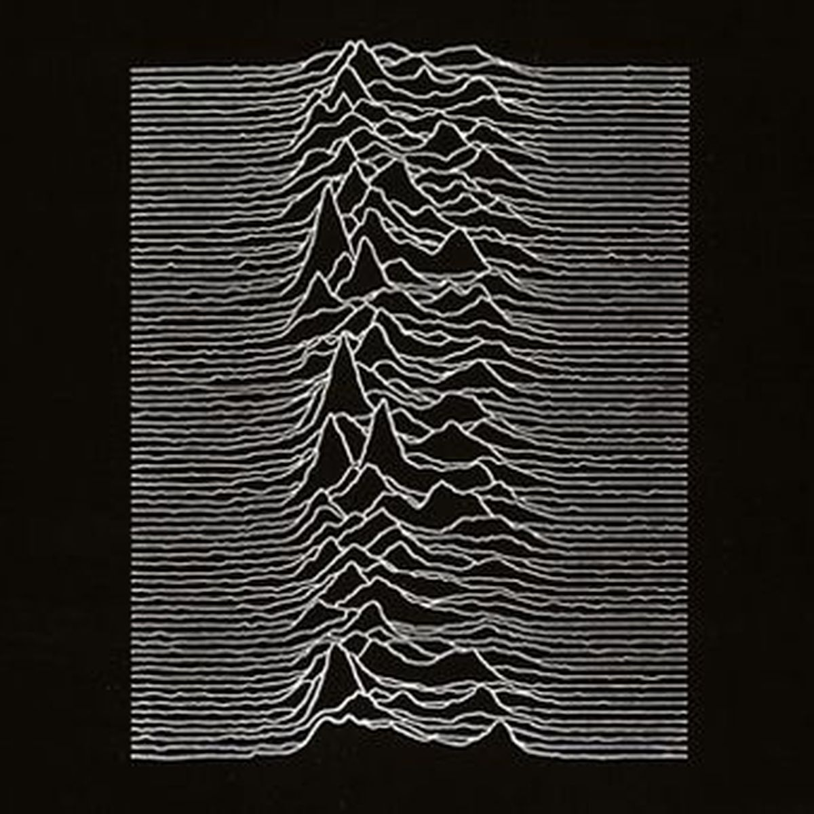

vapor wave
vue 3/4
sensasion d'avancer
map de hauteure et texture
carte topologique de planete ou de lune?

monochrome; peut changer de couleur ig mais couleur/noir

mouvement de rotation

ligne ou particule

inspiration :

[reve_quantique](https://able-journal.org/fr/reve-quantique/)

[homodyne](https://archive.aec.at/pic/showmode/95991/)

[turbulence](https://www.flickr.com/photos/arselectronica/33342545038/in/photostream/)

[turbulence](https://www.flickr.com/photos/arselectronica/52061365089)

voir: 
monoskop